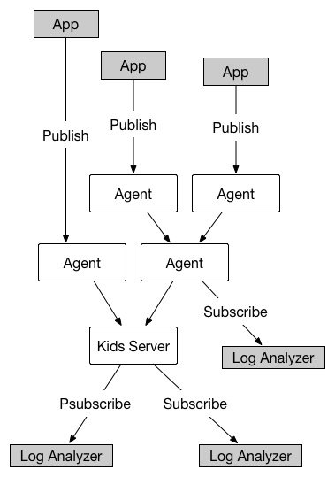

# kids

[![Build Status]][Travis CI]

Kids is a log aggregation system.

It aggregates messages like [Scribe](https://github.com/facebookarchive/scribe) and its pub/sub pattern is ported from [Redis](http://redis.io/).

[中文文档](README.zh_CN.md)
## Features

* Real-time subscription
* Distributed collection
* Message persistence
* Multithreading
* Redis protocol
* No third-party dependencies

## Quickstart

### From Source

You need a complier with C++11 support like GCC 4.7 (or later) or [Clang](http://clang.llvm.org).

Download a [source release](https://github.com/zhihu/kids/releases), then:
	
	tar xzf kids-VERSION.tar.gz
	cd kids-VERSION
	./configure
    make
    make test  # optional
    make install

By default, it will be installed to `/usr/local/bin/kids`.
You can use the `--prefix` option to specify the installation location.
Run `./configure --help` for more config options.

Kids comes with some sample config files in `samples/`, after building, simply run:

    kids -c samples/dev.conf

Because kids uses redis protocol, you can use `redis-cli` to play with it, open another terminal:
    
    $ redis-cli -p 3888
    $ 127.0.0.1:3388> PSUBSCRIBE *

In yet another terminal:
    
    $ redis-cli -p 3388
    $ 127.0.0.1:3388> PUBLISH kids.testtopic message

`redis-cli` needs `redis` to be installed. On Mac, you can run `brew install redis` to install it. On Linux, run `sudo apt-get install redis-tools`

Run `kids --help` for more running options.

### Using docker

Do the following:

    git clone https://github.com/zhihu/kids.git
    cd kids
    cp samples/dev.conf debian/kids.conf
    docker build -t zhihu/kids .

Now you can run it like this:
    
    docker run -d -p 3388:3388 zhihu/kids

You can also specify the config file like this: 
    
    docker run -d -v /path/to/kids/conf:/etc/kids.conf -p 3388:3388 zhihu/kids

## Configuration

See [configuration](doc/config.md).

## Run in production

see [production](doc/deploy.md).

## Developer

You will need

* build-essential
* libtool
* automake
* c++ compiler with c++ 11 support like gcc4.7+ or [Clang](http://clang.llvm.org)

to build kids from source. Run the following to build kids:

	./autogen.sh
	./configure
	make

## License

Kids Uses BSD-3, see LICENSE for more details.

## FAQ

Q: What is the meaning of "kids"?  
A: "kids" is the recursive acronym of "Kids Is Data Stream".

## Architecture

[Build Status]: https://img.shields.io/travis/zhihu/kids/master.svg?style=flat
[Travis CI]:    https://travis-ci.org/zhihu/kids
