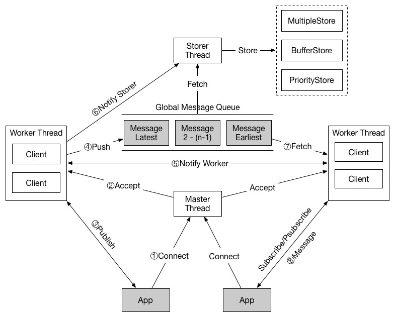

线程模型
--------



1. 应用调用 `connect` 连接到 kids，被 master 线程 accept
2. Master 线程将 fd 分配给 worker 线程，创建 client 对象
3. 应用使用 Redis 协议的 `publish` 命令发送日志到 kids
4. Worker 线程解析命令，将日志放入全局队列
5. 当前 worker 线程通知其他 worker 线程从队列中取日志
6. 同时，通知 storer 线程从队列中取出日志，进行存储
7. Worker 线程取出日志，寻找订阅该日志的客户端
8. 发送给对应的客户端

源代码结构
----------

1. master.cc 
	- 运行在主线程
	- 解析配置文件
	- 接受客户端建立的连接请求，使用 round-robin 算法分配给 worker 线程
	- 旧消息的垃圾回收
	- 获取运行时 worker 线程和 storer 线程的状态信息
	
2. worker.cc
	- 运行在工作线程
	- 接受处理来自客户端的命令
	
3. storer.cc
	- 运行在存储线程
	- 将全局队列中的日志进行存储

4. client.cc
	- 客户端对象，一个 worker 拥有许多 clients 对象，并且按照订阅的 topic 分类

5. buffer.cc
	- 二进制安全的字符串缓存实现
	
6. msgqueue.cc
	- 全局消息队列的实现

7. filesystem.cc
	- FileStore 中使用到的文件处理函数的实现
	
8. conf.cc
	- 解析配置文件的函数



